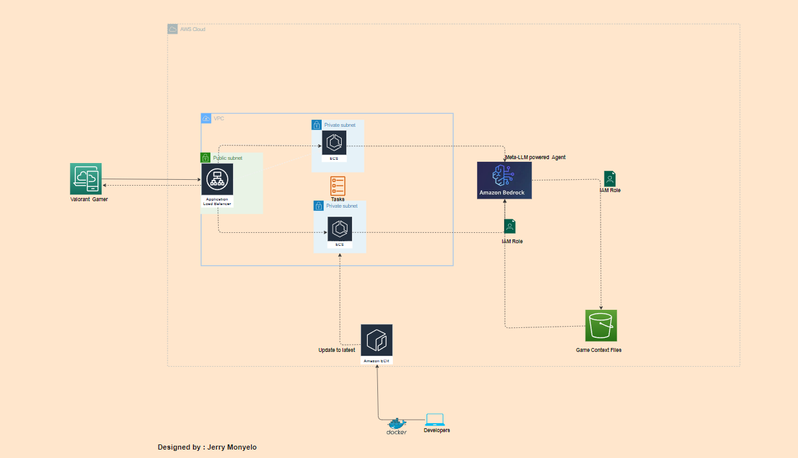

This the App created by Jerry Monyelo and team for the purpose of the VCT Hackathon: Esports Manager Challenge on devpost.com

the app is currently hosted at http://agent-aapps-920641776.us-east-1.elb.amazonaws.com/ for the judges to test

User Interface:

The app has a Streamlit-based web interface with a custom background image related to Valorant.

It's titled "EA SportS Valorant game Assistant" and it leverages Amazon Bedrock

The app and it's backend services are hosted on AWS

Chat Functionality:

Users can interact with the assistant through a chat interface.

The chat history is maintained throughout the session.

AI Integration:

The app uses Amazon Bedrock to power its AI capabilities.

It connects to a specific Bedrock agent using Agent ID and Agent Alias ID (which are set in the sidebar).

Query Processing:

When a user enters a question, it's sent to the Bedrock agent for processing.

The agent's response is then displayed in the chat interface.

Response Handling:

The AI's responses are parsed and formatted for display.

Responses include the main text content and potentially source references.

Styling and Layout:

The app uses a custom background image, likely featuring Valorant agents.

Chat messages are displayed with a semi-transparent black background for better readability.

Additional Features:

There's an option to view the raw bot response in an expandable section.

Users can clear the chat history if needed.

# List of Questions that can be asked

Based on the provided data, here's a list of questions that can be asked from the agent:

What is the full name of the team with the acronym LH?

Which team has the slug "lone-way-esports"?

What is the acronym for the team "MIR Gaming"?

Can you tell me the name of the team with the ID "112439825505751243"?

Which team has "pixel" as its slug?

What is the full name of the team with the acronym UR?

How many teams have "GC" in their name?

What is the acronym for the team "Cherish Girls"?

Which team has "SPEAR GAMING FEMALE" as its full name?

What is the slug for the team with the acronym SGA?

How many unique teams are listed in this data?

Are there any teams that have multiple entries with different acronyms?

Which teams don't have a dark logo URL?

What is the home league ID for most of the teams?

Is there a team with a different home league ID from the others?

What is the full name of the team with the acronym OGX?

How many teams have "Gaming" in their name?

Which team has the longest full name?

Are there any teams with identical IDs but different acronyms?

What is the most common word in team names (excluding common words like "the", "and", etc.)?

# Valorant Game Assistant Infrastructure

This folder contains Terraform configurations to set up the infrastructure for the Valorant Game Assistant application on AWS.

## Overview

This Terraform configuration sets up the following AWS resources:

- Application Load Balancer (ALB)
- ALB Target Group
- ALB Listener (HTTP and HTTPS)
- ECS Cluster
- ECS Task Definition
- ECS Service
- Security Groups
- IAM Roles and Policies
- Amazon Bedrock
- S3 Bucket
- OpenSearch
- CloudWatch Log Group
- (Add any other resources your configuration includes)

## Prerequisites

Before you begin, ensure you have the following:

- [Terraform](https://www.terraform.io/downloads.html) (version 0.12 or later)
- AWS CLI configured with appropriate credentials
- An AWS account with necessary permissions to create the resources

# Datasets for Valorant Game Assistant

This folder contains datasets used to train and enhance the Valorant Game Assistant AI.

## Overview

The datasets in this folder are crucial for providing accurate and relevant information about Valorant to users of our AI assistant. They cover various aspects of the game, including:

- Agent information
- Weapon statistics
- Map details
- Game mechanics
- Patch notes and updates

# Datasets

The script will:
1. Transfer esports data files (leagues, tournaments, players, teams, mapping data)
2. Download the mapping data
3. Use the mapping data to download individual game files
4. Transfer all files to the destination S3 bucket

## Functions

- `transfer_gzip_to_s3(file_name)`: Downloads a gzip file, decompresses it, and uploads to S3
- `transfer_esports_files()`: Transfers main esports data files
- `transfer_games()`: Transfers individual game files based on mapping data

## Error Handling

- The script prints error messages for failed downloads or uploads
- It ignores 404 errors (file not found) and continues with the next file

## Performance

- The script prints progress every 10 games processed
- It displays the total run time for game processing

## Security Note

This script uses AWS credentials. Ensure that these credentials are kept secure and not shared or committed to version control.

## Customization

You can modify the `LEAGUE` and `YEAR` variables to download data for different leagues or years.

## Contributing

If you'd like to contribute to this project, please fork the repository and submit a pull request with your changes.

## License

[Specify the license under which this script is released]

## Disclaimer

This script is for educational and research purposes. Ensure you have the necessary rights and permissions to access and use the data you're downloading.
